# Projeto prático de nº3 do programa de especialização/residência em sistemas eletrônicos embarcados.
Organizado em uma parceria MCTI/Softex + CPQD + FIAP

---

#### Para dúvidas, comentários ou sugestões fiquem à vontade, estarei à disposição através de minha página: 

link do overleaf com a [doc provisória](https://www.overleaf.com/project/69850e0b3ed4867cd1915cac)

links do draw.io:

* [Diagrama Geral](https://drive.google.com/file/d/19P7n8HH2ntk0AozeMG-ax0MThreavw5b/view?usp=sharing)
* [Fluxograma do Sistema](https://app.diagrams.net/#G1lBIXfRnp0AMUoXh9VU9wFyvFj2jhZB6u#%7B%22pageId%22%3A%22SKCNiIy7pvsI1ocINuwh%22%7D)

---

# Projeto prático em grupo — Sistema de **Forno IoT**
Projeto do programa de especialização/residência em sistemas eletrônicos embarcados (parceria MCTI/Softex + CPQD + FIAP)

---

#### Contato
Para dúvidas, comentários ou sugestões:

- [Matheus Grossi](https://www.linkedin.com/in/matheus-grossi/)
- [Talles Mello](https://www.linkedin.com/in/tallesmello/)
- [Manassés Loiola](https://www.linkedin.com/in/manass%C3%A9s-loiola-de-souza-0b213624/)
- [Helton Abadia](https://www.linkedin.com/in/helton-rosa-da-silva-abadia-6177892ab/)

#### Links
[Wokwi](https://wokwi.com/projects/454130082230099969)

[Ubidots](https://stem.ubidots.com/app/dashboards/69701418221d689174891929)

---
## Objetivo?

 
O sistema simula um **forno com conectividade IoT**. O ESP32:

1. Lê a **temperatura** do NTC.
2. Lê o **potenciômetro** (referência do usuário), que pode ser usado como:
   - **setpoint** (temperatura-alvo), ou
   - **potência/PWM** diretamente (duty cycle).
3. Com o forno habilitado pelo **botão**, calcula a saída e aciona o **LED** (representando a resistência).
4. Publica periodicamente os dados via MQTT (ex.: temperatura, referência, estado do forno e saída).
5. Exibe informações no **display** (a integrar no circuito).
6. Hospeda um **Servidor Web Local** na porta 80, permitindo visualização da interface simulada e dos dados em tempo real na rede de borda.

## Índice:

1. [Descrição do projeto](#1-descrição-do-projeto)
2. [Dimensionamento e lista de materiais](#2-dimensionamento-e-lista-de-materiais)
 2.1. [Cálculo do resistor para os LED](#21-cálculo-do-resistor-para-os-led)
 2.2. [Dimensionamento dos resistores para os LEDs](#22-dimensionamento-dos-resistores-para-os-leds)
3. [Lista de materiais utilizados nesta aplicação](#3-lista-de-materiais-utilizados-nesta-aplicação)
 3.1. [Critérios de projeto](#31-critérios-de-projeto)
4. [Conexão ao canal de comunicação com o broker Mosquitto/EMQX](#4-conexão-ao-canal-de-comunicação-com-o-broker-mosquittoemqx)
5. [Arquitetura do firmware](#5-arquitetura-do-firmware)
6. [Interação ao Thingspeak](#6-interação-ao-thingspeak)
7. [Arquitetura de Conectividade, Segurança e Compliance](#7-arquitetura-de-conectividade-segurança-e-compliance)

---
## 1. Descrição do projeto:

Este trabalho se objetivou a criação de um sistema de forno elétrico IOT;

Implementação de um broker que centraliza nossos dados e ainda fornece um dashboard.

Desenvolvimento de uma IHM à partir do display LCD 320x240 - IL9341, simplificando a centralização visual de nossos dados.

### 2. Dimensionamento e lista de materiais: 

#### 2.1 Cálculo do resistor para os LED:

Serão utilizados dois leds neste contexto, o amarelo que simula uma iluminação de área externa controlado pelo relé, enquanto o led vermelho representa a luz de alerta, acionada diretamente pelo gpio, as fórmulas abaixo representam o modo de cálculo para dimensionamento:

 
 
2.1.1. Resistência mínima segura:

$$
R(\Omega) = \frac{V_{pp} - V_{led}}{I_{led}}
$$ 

 

2.1.2. Dissipação no resistor:

$$
P(W) = U*i
$$

2.1.3. Potência mínima do resistor:
 
*Fs é um fator de segurança, idealmente adoto 50%*
 

$$
Pmin = P(W) * (1+Fs)
$$
 
 

*Vale ressaltar que a tensão máxima de trabalho no gpio do ESP32-S3-DEVKITC-1-N8R8 é de 3.3V, portanto Vpp = 3.3V*

| **Tabela de caracteristicas técnicas dos LEDs** |
| :---: |
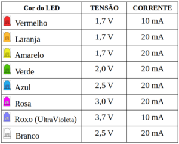
| **Tabela de resistores comerciais** |
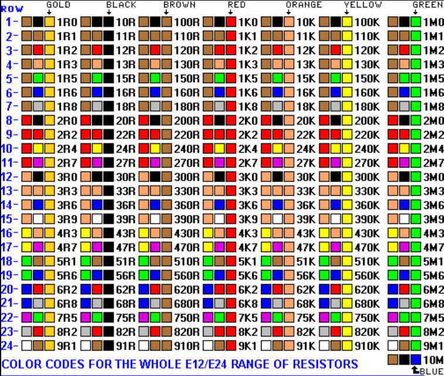
| **Diagrama de potências de resistores comerciais** |
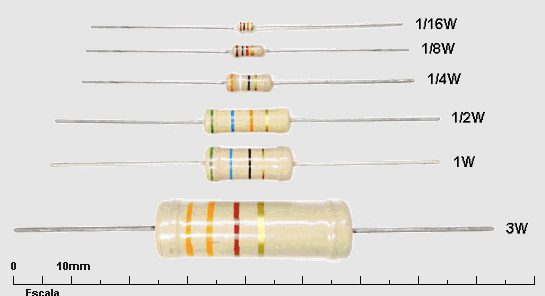

#### 2.2 Dimensionamento dos resistores para os LEDs:

O led vermelho em carga plena utiliza 1.7V, e sua corrente é de 10mA (0.01A), para tal:

 
 

$$
R(\Omega) = \frac{3.3 - 1.7}{0.01} = \frac{1.6}{0.01} = 160\Omega
$$

 

$$
P(W) = U*i = 1.6 * 0.01 = 0.016W
$$

 

$$
Pmin = U*i = 0.016W * (1+0.50)=0.024W
$$
 

Como vimos na tabela acima esse valor de resistor é uma medida comercial, no entanto, não existe resistor de 0.024W, o valor comercial mais próximo arredondando para cima é o de 1/16W (0.0625W).

---
O led amarelo em carga plena utiliza 1.7V, e sua corrente é de 20mA (0.02A)

 

$$
R(\Omega) = \frac{3.3 - 1.7}{0.02} = \frac{1.6}{0.02} = 80\Omega
$$

 

$$
P(W) = U*i = 1.6 * 0.02 = 0.032W
$$

 

$$
Pmin = U*i = 0.032W * (1+0.50)=0.048W
$$
 

Como vimos na tabela acima esse valor de resistor, não é uma medida comercial, portanto ao arredondar usaremos um de 82R, além disso, não existe resistor de 0.048W, o valor comercial mais próximo arredondando para cima é o de 1/16W (0.0625W).

## 3 Lista de materiais utilizados nesta aplicação:

 

| **Item** | **Imagem** | **Link referêcia** |
| :--- | :---: | :---: |
| **ESP32-S3-DEVKITC-1-N8R8** | 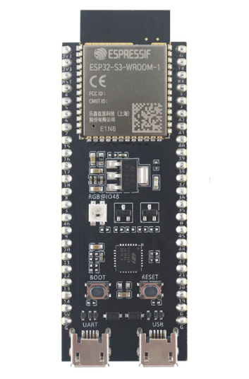 | [Link-1](https://www.digikey.com.br/en/products/detail/espressif-systems/ESP32-S3-DEVKITC-1-N8R8/15295894) |
| **Display LCD 20x4** | 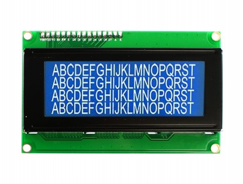 | [Link-2](https://www.usinainfo.com.br/display-arduino/display-lcd-20x4-com-fundo-azul-2727.html?srsltid=AfmBOoo_T0yx8DeO8kDobWg-LXnzvC8cdNzDUk0HhwmnHMre7m4wweJD) |
| **Sensor de temperatura NTC-10K** | 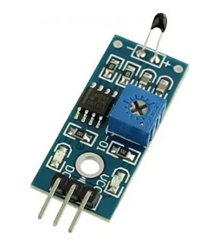 | [Link-3](https://www.arducore.com.br/modulo-sensor-de-temperatura-ntc?srsltid=AfmBOoq0kWVqQLXZ2cuCdpVPkEVKR5jUI-C0HkQP3z2ZFlozv6QAMyRD) |
| **Push-Button** | 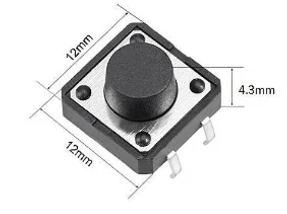 | [Link-4](https://www.eletrogate.com/push-button-chave-tactil-6x6x6mm?srsltid=AfmBOop5mCOiH2MCIOyZxYxCbOE5eBJbDxK-dSsRCbRR-rpGESQx8RGx) |
| **Led vermelho** | 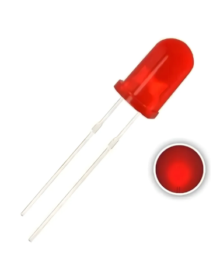 | [Link-5](https://www.mercadolivre.com.br/kit-1000-leds-difusos-lamp-5mm-vermelhos-para-projetos-eletrnicos/p/MLB43986681?pdp_filters=item_id%3AMLB5197656606&from=gshop&matt_tool=91562990&matt_internal_campaign_id=&matt_word=&matt_source=google&matt_campaign_id=22090193891&matt_ad_group_id=174661984004&matt_match_type=&matt_network=g&matt_device=c&matt_creative=727914181090&matt_keyword=&matt_ad_position=&matt_ad_type=pla&matt_merchant_id=735098660&matt_product_id=MLB43986681-product&matt_product_partition_id=2392713578861&matt_target_id=aud-1967156880386:pla-2392713578861&cq_src=google_ads&cq_cmp=22090193891&cq_net=g&cq_plt=gp&cq_med=pla&gad_source=1&gad_campaignid=22090193891&gbraid=0AAAAAD93qcB9rle_WedL6atW03-Klp6f_&gclid=Cj0KCQiA-NHLBhDSARIsAIhe9X0RUuj74fUpQcMN1MXpvSVynh04RoKwYq0xg9n8QLxBREtiGrHlpbEaAl_qEALw_wcB) |
| **Resistor 160R 1/16W** | 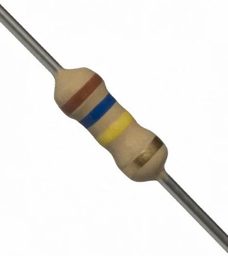 | [Link-6](https://curtocircuito.com.br/resistor-160r-1-4w-5.html?srsltid=AfmBOooummxSfqPPxtEGCP2oIGFGCHLwrRuSj9kSmuDmM7-aB_z1A_wM) |
| **Resistor 82R 1/16W** | 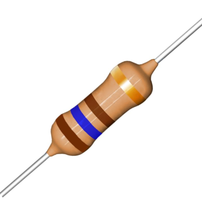 | [Link-7](https://www.eletronicacuiaba.com/resistor-82r-1w?srsltid=AfmBOoolW35wzi-zIkhnYBgZPu3kQA6LoSaOEcVuWnducEBeAkPMe61_) |
| **Potenciometro de 10kR** | 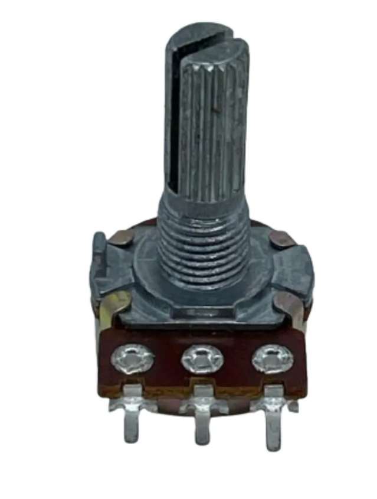 | [Link-8](https://www.eletrogate.com/potenciometro-linear-10k?utm_source=Site&utm_medium=GoogleMerchant&utm_campaign=GoogleMerchant&gad_source=4&gad_campaignid=22470016551&gbraid=0AAAAADqxjs-rOciFRnyUc_60MucHtBFyV&gclid=CjwKCAiAkbbMBhB2EiwANbxtbVreQzrpeN-PZUCqvB4BPiUrgYc2YFjf_it2SdSrdO_waFcdgcZb9xoCvjkQAvD_BwE) |

### 3.1 Critérios de projeto:

A Imagem abaixo ilustra o mapa de I/Os do microcontrolador de nosso projeto:
 

 

| **ESP32-S3-DEVKITC-1-N8R8** |
| :---: |
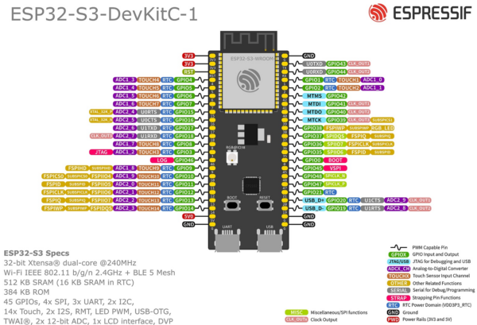

A imagem nos demonstra que alguns pinos são para funções específicas do MCU, e devem ser usadas com cuidado.
Em nosso projeto, foi adotado o seguinte mapa de conexões:

 

 

| **Pino** | **Função** |
| :---: | :--- |
| GPIO 4 | Entrada Digital: Push-Button |
| GPIO 11 | Entrada Analógica: Sensor de temperatura NTC |
| GPIO 12 | Entrada Analógica: Potenciometro |
| GPIO 14 | Saída Digital: Controle PWM |
| GPIO 36 | Entrada Digital (SPI): TFT - MISO |
| GPIO 38 | Saída Digital (SPI): TFT - SCK |
| GPIO 39 | Saída Digital (SPI): TFT - MOSI |
| GPIO 40 | Saída Digital (SPI): TFT - DC |
| GPIO 41 | Saída Digital (SPI): TFT - RST |
| GPIO 42 | Saída Digital (SPI): TFT - CS |

Essa é a representação visual das conexões:

| **Diagrama de conexões** |
| :---: |
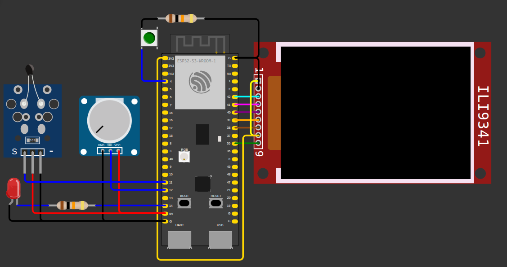

Essa é a representação visual das conexões:

| **Ação** |
| :--- |
| O 1º estágio do boot transiciona para uma breve tela exibindo "Display inicializado"|
|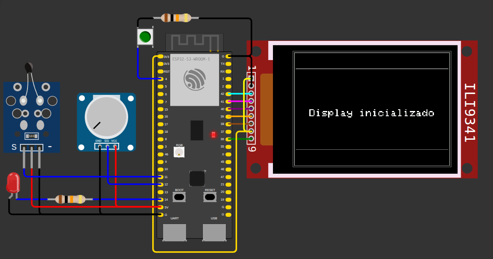|
| O 2º estágio do boot apresenta rapidamente o escopo de projeto e exibe os nomes dos integrantes da equipe.|
|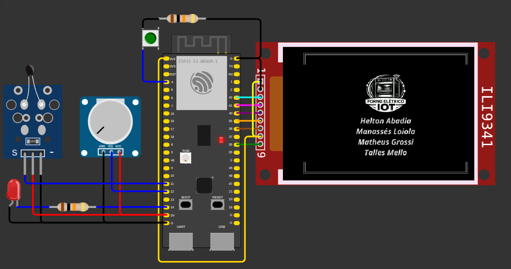|
| O 3º estágio do boot demonstra os organizadores do curso.|
|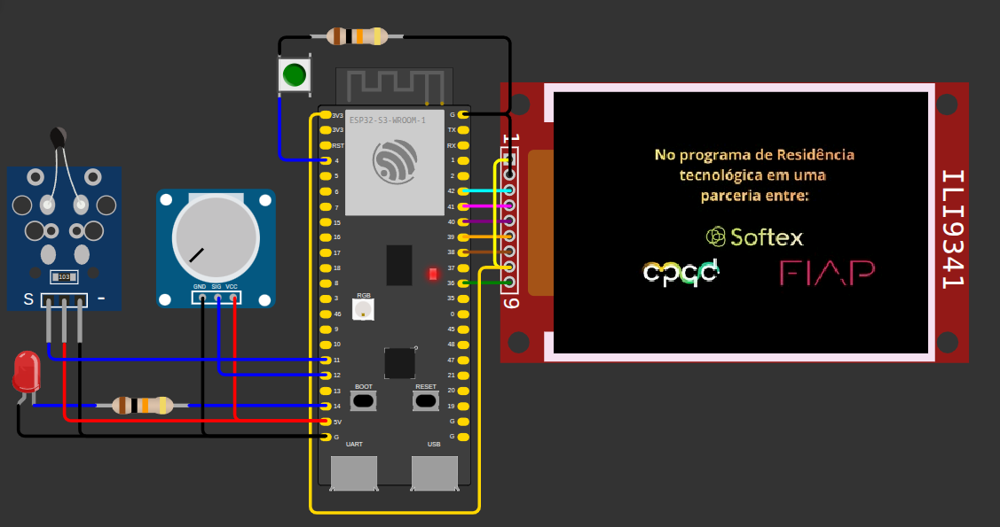|
| A tela final demonstra o processo de operação em regime permanente.|
|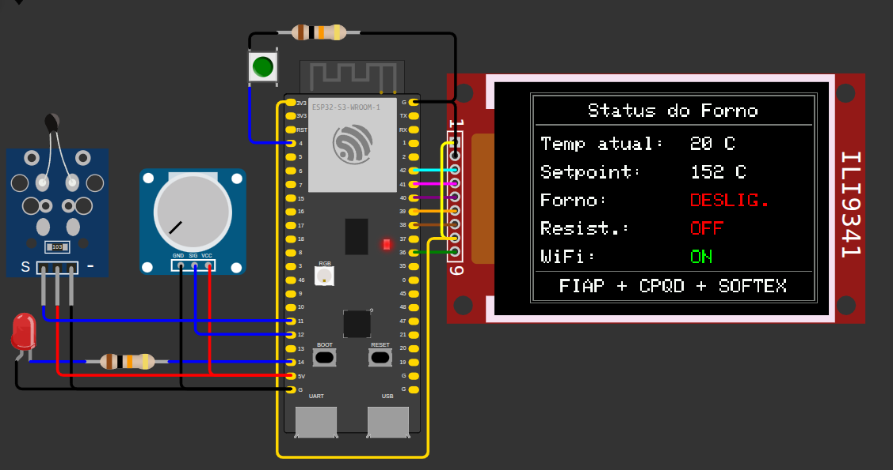|

## 5. Arquitetura do firmware:

| **Arquivo** | **Função** |
| :--- | :--- |
| [main.cpp](src/main.cpp)   | Responsável por processar e executar as funções primárias. |
| [wifi.cpp](src/wifi.cpp)   | Centraliza os comandos necessários para conexão ao wi-fi. |
| [http.cpp](src/http.cpp)  | Centraliza os comandos necessários para conexão ao broker. |
| [tft.cpp](src/tft.cpp) | Adiciona o suporte ao uso do display TFT LCD 320x240 IL9341 |
| [img1.cpp](src/img1.cpp) | Adiciona o cabeçalho de inicialização 1, que pode ser visto na próxima secção.|
| [img2.cpp](src/img1.cpp) | Adiciona o cabeçalho de inicialização 2, que pode ser visto na próxima secção.|
| [tft.h](src/wifi_con.h) | Chamada das funções recursivas de conexão ao display. |
| [http.h](src/mqtt_con.h) | Chamada das funções recursivas de conexão ao HTTP. |

## 6. Interação ao Thingspeak:

Através desse processo torna-se possível a implementação de um dashboard para montiramento das grandezas:

| **Imagens do dashboard em operação** |
| :--- |
||

---

## 7. Arquitetura de Conectividade, Segurança e Compliance

Para atender aos requisitos de desempenho e integração web, a arquitetura do projeto utiliza uma abordagem híbrida de conectividade (Edge-to-Gateway-to-Cloud):

1. **Protocolo Leve na Borda (MQTT):** O microcontrolador ESP32 publica as telemetrias e status utilizando MQTT (via HiveMQ/Mosquitto). Isso otimiza o consumo de memória e banda do dispositivo físico.
2. **Integração Web (HTTP/HTTPS REST):** Um Gateway IoT em nuvem (Node-RED) foi configurado para assinar os tópicos MQTT e atuar como ponte. O Node-RED realiza o envio pesado de dados através de requisições **POST via HTTP/HTTPS (REST)** para os *endpoints* das plataformas ThingSpeak e Ubidots, cumprindo plenamente a exigência de integração web estipulada no projeto.

**Segurança e Compliance:**
* **Isolamento de Credenciais:** As chaves de acesso sensíveis (Write API Key do ThingSpeak e o Token X-Auth do Ubidots) não ficam expostas no código fonte do firmware (C++). Elas estão seguras e encapsuladas exclusivamente no Gateway Node-RED.
* **Processamento Local (Borda):** O firmware do equipamento não é um mero repassador de dados. Ele aplica lógicas ativas de proteção e processamento local: **Filtragem de ruído** (Média Móvel nas leituras analógicas) e **Histerese/Thresholds** (controle rigoroso de acionamento da resistência elétrica, garantindo operabilidade e segurança física do forno antes mesmo de os dados irem para a nuvem).